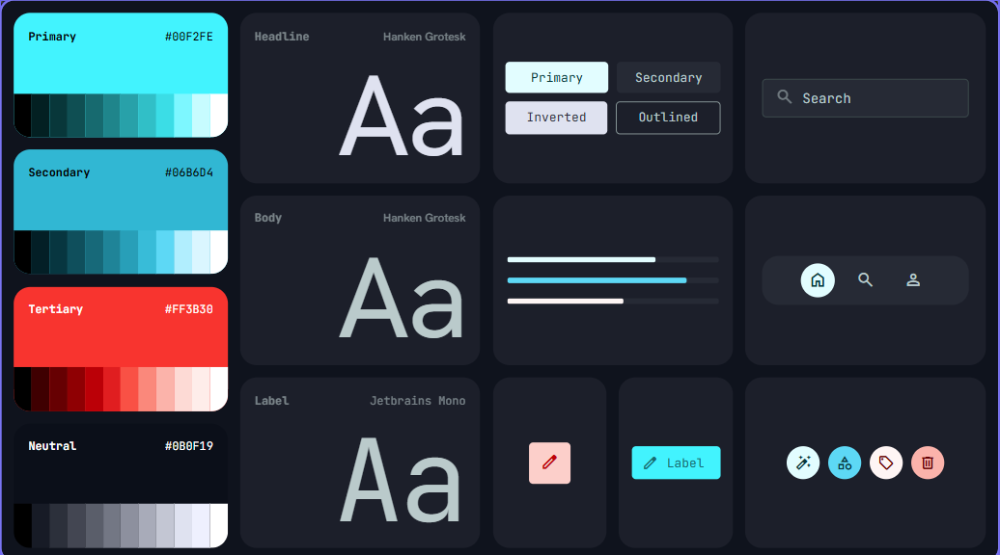
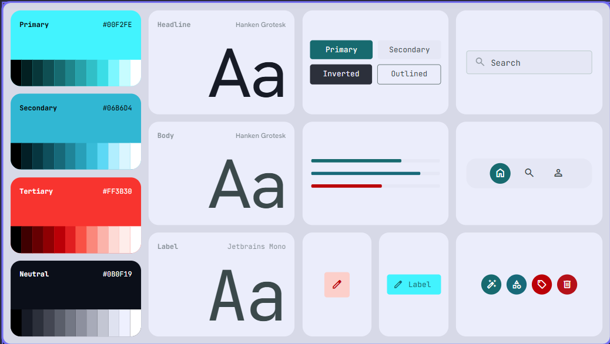

themes
name: JusticeStack 2026

Dark mode:

light mode:

---
name: JusticeStack 2026 (Dual Theme)
colors:
  dark:
    surface: '#0f131d'
    surface-dim: '#0f131d'
    surface-bright: '#353944'
    surface-container-lowest: '#0a0e18'
    surface-container-low: '#171b26'
    surface-container: '#1c1f2a'
    surface-container-high: '#262a35'
    surface-container-highest: '#313540'
    on-surface: '#dfe2f1'
    on-surface-variant: '#b9cacb'
    inverse-surface: '#dfe2f1'
    inverse-on-surface: '#2c303b'
    outline: '#849495'
    outline-variant: '#3a494b'
    surface-tint: '#00dce6'
    primary: '#e0fdff'
    on-primary: '#00373a'
    primary-container: '#00f2fe'
    on-primary-container: '#006a70'
    inverse-primary: '#00696f'
    secondary: '#4cd7f6'
    on-secondary: '#003640'
    secondary-container: '#03b5d3'
    on-secondary-container: '#00424e'
    tertiary: '#fff5f4'
    on-tertiary: '#690003'
    tertiary-container: '#ffd0ca'
    on-tertiary-container: '#c3000a'
    error: '#ffb4ab'
    on-error: '#690005'
    error-container: '#93000a'
    on-error-container: '#ffdad6'
    background: '#0f131d'
    on-background: '#dfe2f1'
  light:
    surface: '#f4f5f8'
    surface-dim: '#e9ebf0'
    surface-bright: '#ffffff'
    surface-container-lowest: '#ffffff'
    surface-container-low: '#f0f1f5'
    surface-container: '#e9ebf0'
    surface-container-high: '#dfe2e9'
    surface-container-highest: '#d5d9e2'
    on-surface: '#0f131d'
    on-surface-variant: '#3a494b'
    inverse-surface: '#0f131d'
    inverse-on-surface: '#dfe2f1'
    outline: '#5c6b6c'
    outline-variant: '#b9cacb'
    surface-tint: '#00696f'
    primary: '#00373a'
    on-primary: '#ffffff'
    primary-container: '#006a70'
    on-primary-container: '#e0fdff'
    inverse-primary: '#00f2fe'
    secondary: '#003640'
    on-secondary: '#ffffff'
    secondary-container: '#00424e'
    on-secondary-container: '#acedff'
    tertiary: '#690003'
    on-tertiary: '#ffffff'
    tertiary-container: '#c3000a'
    on-tertiary-container: '#ffdad5'
    error: '#690005'
    on-error: '#ffffff'
    error-container: '#ffdad6'
    on-error-container: '#93000a'
    background: '#f4f5f8'
    on-background: '#0f131d'
typography:
  display-lg:
    fontFamily: Hanken Grotesk
    fontSize: 48px
    fontWeight: '700'
    lineHeight: 56px
    letterSpacing: -0.02em
  headline-lg:
    fontFamily: Hanken Grotesk
    fontSize: 32px
    fontWeight: '600'
    lineHeight: 40px
  headline-lg-mobile:
    fontFamily: Hanken Grotesk
    fontSize: 24px
    fontWeight: '600'
    lineHeight: 32px
  title-md:
    fontFamily: Hanken Grotesk
    fontSize: 18px
    fontWeight: '500'
    lineHeight: 28px
  body-md:
    fontFamily: Hanken Grotesk
    fontSize: 16px
    fontWeight: '400'
    lineHeight: 24px
  data-mono:
    fontFamily: JetBrains Mono
    fontSize: 14px
    fontWeight: '400'
    lineHeight: 20px
  label-caps:
    fontFamily: JetBrains Mono
    fontSize: 12px
    fontWeight: '600'
    lineHeight: 16px
    letterSpacing: 0.05em
rounded:
  sm: 0.25rem
  DEFAULT: 0.5rem
  md: 0.75rem
  lg: 1rem
  xl: 1.5rem
  full: 9999px
spacing:
  nav_height: 64px
  sidebar_width: 280px
  sidebar_collapsed: 72px
  gutter: 24px
  margin_desktop: 32px
  margin_mobile: 16px
  base_unit: 8px
---

## Brand & Style

The design system is engineered for high-stakes legal environments requiring absolute security and local-first data integrity. The brand persona is authoritative, technical, and impenetrable. 

As visualized in image.png and image-1.png, the interface supports two distinct contextual states while preserving the exact layout, structure, and functional logic:

*   **Dark Theme (image.png):** Features a **Dark Neon Terminal** style, blending the precision of developer tools with a premium, future-forward legal interface. It evokes a sense of "digital vault" reliability through deep obsidian surfaces, sharp accents of glowing cyan, and a rigid information hierarchy.
*   **Light Theme (image-1.png):** Provides a high-clarity, stark daytime environment. It replaces the deep obsidian layers with ultra-clean, clinical grey and white surfaces, transforming glowing terminal accents into highly deliberate, high-contrast structural focus indicators.

---

## Colors

### Dark Mode (image.png)
The palette is anchored in a deep midnight navy-slate (`#0B0F19` / `#0F131D`) to maximize contrast and reduce eye strain during long-form legal review. 
*   **Primary & Secondary:** A dual-tone Cyan (`#00F2FE`, `#06B6D4`) serves as the "active" state, representing secure connections and verified data.
*   **High-Alert:** Neon Crimson (`#FF3B30`) is reserved strictly for high-priority legal deadlines, security breaches, or destructive actions.
*   **Surfaces:** Containers use a semi-translucent obsidian (`#131B2E`). Borders use a muted slate (`#1E293B`) to define structure without visual noise.
*   **Typography:** Pure white for titles; slate-blue for metadata and labels.

### Light Mode (image-1.png)
The palette flips the polarity, shifting the container architecture to a clean, crisp, clinical paper aesthetic.
*   **Primary & Secondary:** Transition to deep, authoritative teal-slates (`#00373A`, `#00424E`) for text elements, while maintaining controlled instances of vibrant Cyan (`#00F2FE`) for specialized semantic indicators like pills or action highlights.
*   **High-Alert:** Solid Crimson (`#FF3B30` / `#690005`) grounds high-priority states with weighted dark text on light, high-visibility container backgrounds.
*   **Surfaces:** The base layer uses a light grey-blue tint (`#F4F5F8`). Internal containers and cards shift up to pure white (`#FFFFFF`) or light mist grey (`#E9EBF0`), outlined by a refined light border grid (`#B9CACB`).
*   **Typography:** Deep slate-black for primary readability; muted dark slate-grey for subtext and metadata.

---

## Typography

This design system utilizes a high-contrast typographic pairing to distinguish between narrative legal text and technical data.

*   **Hanken Grotesk:** Used for all primary UI text and headlines. It provides a sharp, contemporary sans-serif look that feels professional and efficient.
*   **JetBrains Mono:** Employed for all "Technical Metadata"—including case numbers, timestamps, file sizes, and labels. This reinforces the "Terminal" aesthetic and ensures data remains legible and distinct from prose.
*   **Scale:** Headlines use tight letter spacing and heavy weights to command attention. Data labels use uppercase styling with increased tracking for clarity at small sizes.

---

## Layout & Spacing

The layout is a rigid, persistent structure designed for complex multitasking.

*   **Persistent Navigation:** A 64px top bar houses global search and system status.
*   **Collapsible Sidebar:** A 280px sidebar provides primary navigation. On smaller screens or when minimized, it collapses to a 72px icon-only rail.
*   **Grid System:** A 12-column fluid grid for content, utilizing a 24px gutter. All internal component spacing (padding/margins) follows an 8px base unit.
*   **Mobile Adaptation:** On mobile, the sidebar transitions to a bottom navigation bar or a full-screen overlay menu. Content margins shrink to 16px.

---

## Elevation & Depth

This design system avoids traditional shadows in favor of **Tonal Layers** and **Semantic Borders**.

*   **Z-Axis Hierarchy:** Depth is created through background color shifts. In dark mode, the base is darkest and active containers are slightly lighter obsidian. In light mode, the base is a muted tint while container surfaces lift up to pure stark white.
*   **Glassmorphism:** Overlays and dropdown menus use a 12px backdrop blur with 80% opacity to maintain context of the underlying data.
*   **Focus States:** 
    *   **Dark Mode:** Focused elements emit a subtle Cyan (`#00F2FE`) outer glow (4px-8px blur, 0.3 opacity) to simulate a light-emitting terminal.
    *   **Light Mode:** Focused elements ditch the back-glow emission for a crisp, solid border color shift alongside high-contrast inset fills.
*   **Borders:** Thin 1px borders provide the primary means of separation between UI regions across both themes.

---

## Shapes

The shape language is structured and modern. A consistent `rounded-xl` (12px) radius is applied to all primary containers, cards, and input fields. This softens the "industrial" feel of the theme just enough to ensure the software feels approachable and high-end. 

Smaller elements, such as tags or chips, may use the same radius to maintain a unified visual language across all scales.

---

## Components

### Buttons
*   **Dark Mode:** Primary buttons are solid Cyan with black text. Secondary buttons use a Cyan outline and white text. Ghost buttons use `text-secondary` and show a subtle cyan tint on hover.
*   **Light Mode:** Primary buttons are filled with deep corporate teal (`#00373A`) with white text, or inverted light variations. Secondary buttons utilize sharp dark borders with high-contrast type.

### Inputs
*   **Dark Mode:** Fields are filled with `#1E293B`. Upon focus, the bottom border glows Cyan and emits a neon back-glow.
*   **Light Mode:** Fields are filled with clean white or light grey (`#E9EBF0`), utilizing a thin structured border that hardens to deep teal/cyan on active interaction.

### Cards
*   **Dark Mode:** Uses the container background (`#131B2E`) with a thin slate border. Titles inside cards are always `Pure White`.
*   **Light Mode:** Uses bright container fills (`#FFFFFF`) bounded by a clean light-slate border. Titles are a dark, readable slate-black.

### Status Chips
*   Use Monospace font. "Secure" chips use Cyan variations; "Warning" chips leverage Crimson. Backgrounds for chips use low-opacity versions of the accent color (10-15%) across both dark and light modes to maintain clear status identity.

### Data Tables
*   Highly dense with `1px` horizontal dividers. Header rows use `label-caps` typography. Dark mode maps these lines via thin dark slate; light mode maps them via crisp light grey dividers.

### Terminal Console
*   A specific component for system logs. In dark mode, it utilizes a pure black background with monochromatic `data-mono` typography. In light mode, it retains an inverted crisp slate container box to separate technical logs distinctly from regular legal documentation.